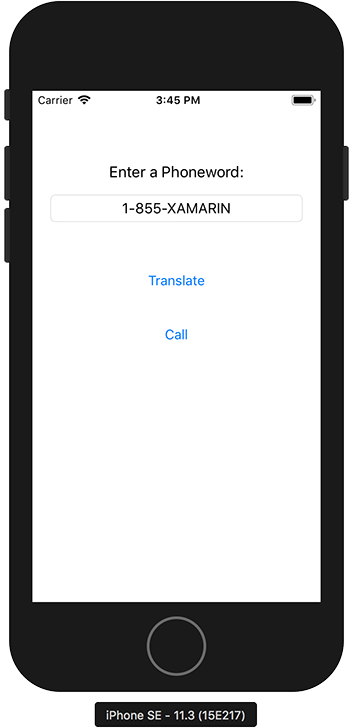

# Phoneword in C# for iOS

This is my implementation of [Hello, iOS
(Xamarin)](https://developer.xamarin.com/samples/monotouch/Hello_iOS/)
in C#.

For comparison, I wrote [my own version in F#](https://github.com/d108/Phoneword-Fsharp).
